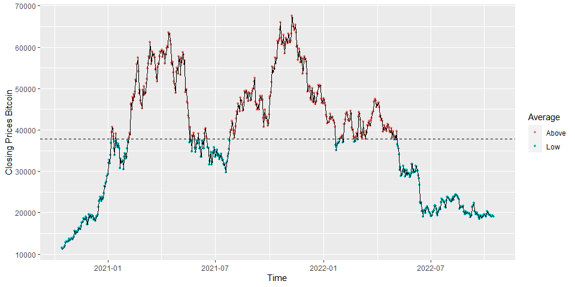
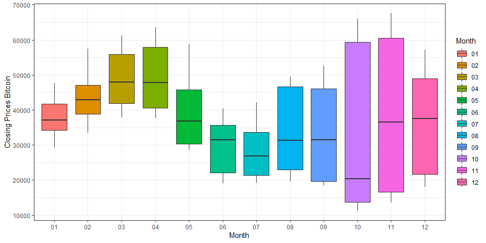
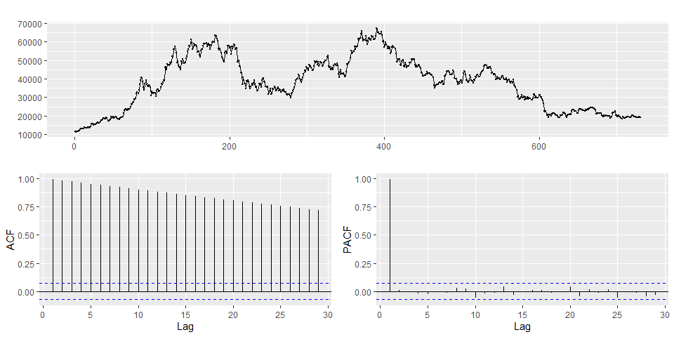
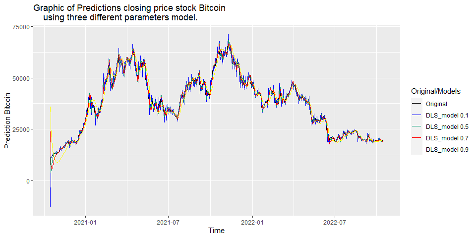
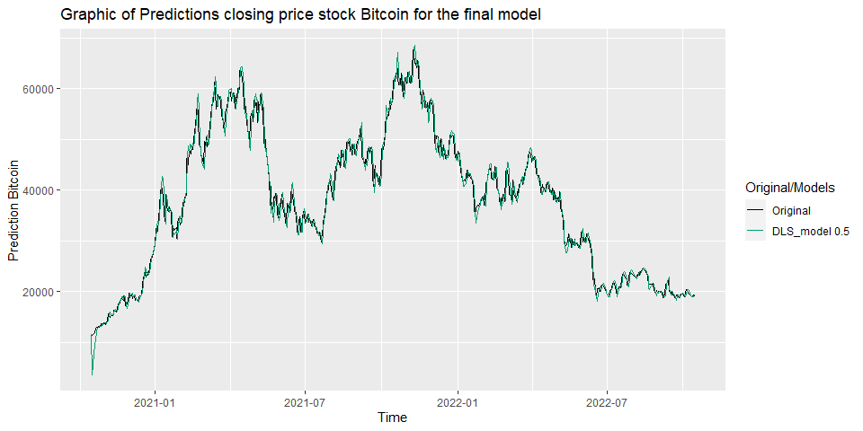

Discounted Least Square approach - Bitcoin closing price
================
Arthur Machado
October 15, 2022

# Introduction

The Bitcoin (BTC) is a cryptocurrency, a virtual currency designed to
act as money and a form of payment outside the control of any one
person, group, or entity, and thus removing the need for third-party
involvement in financial transactions. It is rewarded to blockchain
miners for the work done to verify transactions and can be purchased on
several exchanges. Futher that looking in the technical way, most of the
people economic field know that financial time series can be hard to
make predictions, because when we talking about the market place,
anything can change in instants stocks go down and up everytime, so it
can be in the future the predictions about the series sounds unrealistic
and not according whats happens in real life. However, how i want to
show a simple and practical technique, i will try to make a good
approach about these kind of data. The technique that i mentioned it’s
call Discounted Least Squares (**DLS**), this technique has already been
applied for time series, as we can see in Young and Keith Ord (1985)
that use this method for modelling the growth of the percentage of
households with CATV, showing that is a better approach to short-term
forecasting. Other article that use the same method it’s Refenes et al.
(1997), that concluded the DLS is a more efficient procedure for
“weakly” non-stationary data series. So, with this two articles i
could make a simple application for the closing price Bitcoin.

# Descritive analysis

Before we start to define our approch to handle of closing price of this
stock, we need to understand the data and how it behaves.

``` r
# The libraries
library(readr)
library(tidyverse)
library(tseries)
library(forecast)
library(cowplot)
```

*The path that the data is located has been omitted.*

``` r
data %>% 
  mutate(Average = if_else(Close <= mean(Close), 'Low', 'Above')) %>% 
  ggplot(aes(x = Date, y = Close)) +
  geom_point(aes(color = Average), size = 1) +
  geom_line() +
  geom_hline(yintercept = mean(data$Close), linetype='dashed') +
  ggplot2::labs(x = 'Time', y = 'Closing Prices Bitcoin')
```

<!-- -->

An alternative is to see the variation in the closing prices stock in
different months. From October (10) to November (11) there is a large
variety closing prices, with a small decrease in December. Looking at a
general picture, we can assume that there is a seasonality.

``` r
data %>%
  mutate(month = format(Date,'%m')) %>%
  ggplot() +
  geom_boxplot(aes(y= Close,
                   x= month,
                   fill = month)) +
  labs(x = 'Month', y = 'Closing Prices Bitcoin') +
  guides(fill=guide_legend(title = "Month")) +
  theme_bw()
```

<!-- -->

To step away for an subjective analysis, we can make some measurements
grouping by month, as:

``` r
data %>% 
  mutate(month = format(Date,'%m')) %>% 
  group_by(month) %>% 
  summarise(Minimum = min(Close),
            Median = median(Close),
            Mean = mean(Close),
            Std = sd(Close),
            Maximum = max(Close)) %>% 
  rename('Month' = month)
```

    ## # A tibble: 12 x 6
    ##    Month Minimum Median   Mean    Std Maximum
    ##    <chr>   <dbl>  <dbl>  <dbl>  <dbl>   <dbl>
    ##  1 01     29374. 37046. 37938.  4526.  47687.
    ##  2 02     33537. 42890. 43535.  5569.  57540.
    ##  3 03     37850. 47922. 48482.  7359.  61243.
    ##  4 04     37715. 47813. 49321.  8575.  63503.
    ##  5 05     28628. 36789. 39075. 10006.  58804.
    ##  6 06     19018. 31504. 30114.  6812.  40406.
    ##  7 07     19242. 26826. 27992.  6949.  42236.
    ##  8 08     19617. 31289. 34038. 12036.  49546.
    ##  9 09     18547. 31532. 32872. 13376.  52634.
    ## 10 10     11322. 20337. 36541. 21637.  65993.
    ## 11 11     13550. 36598. 38634. 22360.  67567.
    ## 12 12     18059. 37602. 35623. 14095.  57230.

Using a times series perspective for the closing price, we can se below
the ACF and PACF. To the ACF graph we can suppose there is a
non-stationarity of the data, for an decreasing pattern of the
autocorrelation values across the lags. For the PACF chart we can assume
that the time series behaves like a 1° order difference equation.

``` r
forecast::ggtsdisplay(data %>% pull(Close)) 
```

<!-- -->

# About the model

Direct smoothing or discounted least squares is a technique for updating
the parameters of a multiple linear regression such as:  
$$Y_t = \sum_{i=0}^{p}\beta_ix_i(t) + \varepsilon_t$$ 
for $t=1,\dots,T$, $x_i(t)$ are functions of time. But we need to
estimate the parameters $\beta_i$, one methods for that is called
Discounted Least Squares (**DLS**). The estimates is defined by:  
$$\widehat{\boldsymbol{\beta}}(T) = \mathbf{G}(T)^{-1}\mathbf{g}(T)$$  
where $\mathbf{G}(T) = \mathbf{X}(T)^\top \mathbf{W} \mathbf{X}(T)$
and $\mathbf{g}(T) = \mathbf{X}(T)^\top \mathbf{W} \mathbf{y}$,
$\mathbf{W}$ is a weight matrix such that their magnitudes decrease
with time, given by:  
$$\mathbf{W} =
\begin{bmatrix}
\theta^{T-1} & 0 & \cdots & 0 & 0\\
0 & \theta^{T-2} & \cdots & 0 & 0\\
\vdots & \vdots & \ddots & \vdots & \vdots\\
0 & 0 & \cdots & \theta & 0\\
0 & 0 & \cdots & 0 & 1
\end{bmatrix}$$

For this project we will use an simple model, even more because of
PACF’s evidence, as:

$$Y_t = \beta_0 + \beta_1t + \varepsilon_t, \quad t = 1,\dots, T,$$  
using this model above, the matrix $\mathbf{G}^{-1}(T)$ is definid by:

$$\mathbf{G}^{-1}(T) =
\begin{bmatrix}
1-\theta^2 & (1-\theta)^2\\
(1-\theta)^2 & \frac{(1-\theta)^3}{\theta}
\end{bmatrix}$$

Doing some math operations, the expression of $\widehat\beta_0(T)$ and
$\widehat\beta_1(T)$ are given by:  

$$\begin{eqnarray}
\widehat\beta_0(T) &=& \widehat\beta_0(T-1) + \widehat\beta_1(T-1) + (1-\theta^2) + e_T(1)\\
\widehat\beta_1(T) &=& \widehat\beta_0(T-1) + (1-\theta)^2e_T(1)
\end{eqnarray}$$

An observation that we have to this method it is the initial values are
made from the ordinary least squares method.

The forecast equation for this model is given by:  
$$\widehat{Y}_{T+\tau} = \widehat\beta_0(T) + \widehat\beta_1(T)\tau$$

## Making some comparisons

Before that we will make the model’s function, calling as `DLS_model()`,
as the code below:

``` r
DLS_model <- function(y, theta, h = 0){
  x <- 1:length(y)
  par <- coef(lm(y~x))
  B0=B1=et=c(rep(0,length(y)+h))
  y_est = c(rep(0, length(y)+h))
  et[1] <- y[1] -  par[1] - par[2]
  #Making the first estimative
  B0[1] <- par[1] + par[2] + (1-theta^2)*et[1]
  B1[1] <- par[2] + ((1-theta)^2)*et[1]
  y_est[1] <- B0[1] + B1[1]
  et[1] <- y[1] - y_est[1]
  
  for (i in 2:length(y)){
    B0[i] <- B0[i-1] + B1[i-1] + (1-theta^2)*et[i-1]
    B1[i] <- B1[i-1] + (1-theta)^2*et[i-1]
    y_est[i] <- B0[i] + B1[i]
    et[i] <- y[i] - y_est[i]
  }
  
  # After applying the model we can start the forecasts
  if(h != 0){
    for (j in 1:h){
      B0[length(y)+j] <- B0[length(y)+j-1] + B1[length(y)+j-1] + (1-theta^2)*et[length(y)+j-1]
      B1[length(y)+j] <- B1[length(y)+j-1] + (1-theta)^2*et[length(y)+j-1]
      y_est[length(y)+j] <- B0[length(y)+j] + B1[length(y)+j]
      if(j == 1){value <- y[length(y)]}else{value <- y_est[length(y)+j-1]}
      et[length(y)+j] <-  value - y_est[length(y)+j]
    }
    y_forecast <- y_est[-c(1:length(y))]
  }else{
    y_forecast <- NULL
  }  
  
  y_est <- y_est[c(1:length(y))]
  
  list(y_real = y, y_est = y_est, y_forecast = y_forecast)
   
}
```

We can see in the code above, that the algorithm need an initials
footsteps, this footsteps was made Ordinary Least Squares (**OLS**).
Applying the `DLS_model()` for closing prices bitcoin using
\(\theta = (0.1, 0.5, 0.7)\).

``` r
df_pred <- data %>% 
  mutate(DLS_0.1 = DLS_model(Close, 0.1) %>% pluck('y_est'),
         DLS_0.5 = DLS_model(Close, 0.5) %>% pluck('y_est'),
         DLS_0.7 = DLS_model(Close, 0.7) %>% pluck('y_est'),
         DLS_0.9 = DLS_model(Close, 0.9) %>% pluck('y_est')) %>% 
  select(Date, Close, everything())
```

Making a times series graph using `ggplot()` to see the predictions
performance for each model.

``` r
df_pred %>% 
  pivot_longer(-c(Date), 'type') %>% 
  arrange(type) %>% 
  ggplot(aes(x = Date, y = value, color = type), size = 0.2) +
  geom_line() +
  labs(x = 'Time', y = 'Prediction Bitcoin') +
  scale_colour_manual(name = "Original/Models",
                      values = c("Black", "blue", "#009E73", "red", 'yellow'),
                      labels = c('Original','DLS_model 0.1',
                                 'DLS_model 0.5', 'DLS_model 0.7', 'DLS_model 0.9')) +
  ggtitle(
    label = "Graphic of Predictions closing price stock Bitcoin
    using three different parameters model.")
```

<!-- -->

After that, we can now observe the behavior of the forecasts for each
parameter selected above.

*As this part of the code is more extensive, I decided to hide it, but
it is nothing different from what was presented before.*

<!-- -->

We can see above that the choice of parameters \(\theta\) interferes
with the forecast, that for values from 0.5, the forecasts are smoother
tending to a linear forecast, unlike for \(\theta = 0.1\)

Looking the MSE of each model the lowest value of MSE it is from
\(\theta = 0.5\)

``` r
df_pred %>% 
  pivot_longer(-c(Date, Close), 'type') %>% 
  arrange(type) %>% 
  group_by(type) %>% 
  summarise(MSE = mean((Close - value)^2)) %>% 
  pivot_wider(names_from = type, values_from = MSE)
```

    ## # A tibble: 1 x 4
    ##    DLS_0.1  DLS_0.5  DLS_0.7  DLS_0.9
    ##      <dbl>    <dbl>    <dbl>    <dbl>
    ## 1 4856280. 2946594. 3545273. 9219249.

# Cross-validation

Ok, after analysing the model’s performance we need to choose the best
smoothing parameter. The ideia it’s to apply the model for every value
of the parameter defined on own support, for each parameter we catch the
Man Square Error (MSE) to comparing the results later.

``` r
theta <- seq(0.1, 0.9, by = 0.1)
MSE_validation <- tibble(Theta = theta, MSE = numeric(length(theta)))
y <- data %>% pull(Close)
for(i in 1:length(theta)){
  pred <- DLS_model(y, theta[i]) %>% pluck('y_est')
  MSE_validation[i,2] <- mean((y - pred)^2)
}

MSE_validation %>% filter(MSE == min(MSE))
```

    ## # A tibble: 1 x 2
    ##   Theta      MSE
    ##   <dbl>    <dbl>
    ## 1   0.5 2946594.

The best performance was for \(\theta = 0.5\)

# Fitting the time series

We can see that there is a certain discrepancy of the predictions for
the time series initial values, but after that the model had a good fit.

``` r
df_final <- df_pred %>% select(Date, Close, DLS_0.5)


df_final %>% 
  pivot_longer(-c(Date), 'type') %>% 
  arrange(type) %>% 
  ggplot(aes(x = Date, y = value, color = type), size = 0.2) +
  geom_line() +
  labs(x = 'Time', y = 'Prediction Bitcoin') +
  scale_colour_manual(name = "Original/Models",
                      values = c("Black", "#009E73"),
                      labels = c('Original', 'DLS_model 0.5')) +
  ggtitle(label = "Graphic of Predictions closing price stock Bitcoin for the final model")
```

<!-- -->

Now we can try to make ten steps ahead forecasts, to see how it goes. As
we can see below in the chart, I only plotted the values from the day
2022-09-01.

``` r
df_forecast <- data %>% 
    mutate(Type = 'Observed') %>% 
    bind_rows(
  tibble(Close = DLS_model(y = data$Close, theta = 0.5, h = 10) %>% pluck('y_forecast'),
         x = 1:length(Close),
         Date = data %>% tail(1) %>% pull(Date) + 86400*x) %>% 
    select(Date, Close) %>% 
    mutate(Type = 'Predictions')
    )

df_forecast %>% 
  filter(Date >= '2022-09-01') %>% 
  ggplot(aes(x = Date, y = Close, color = Type), size = 0.2) +
  geom_line() +
  labs(x = 'Time', y = 'Prediction Bitcoin') +
  scale_colour_manual(name = "Original/Models",
                      values = c("Black", "#009E73"),
                      labels = c('Original', 'DLS 0.5')) +
  ggtitle(label = "Graphic of Forecast closing price stock Bitcoin for the final model")
```

<!-- -->

    ## # A tibble: 10 x 2
    ##    Date                 Close
    ##    <dttm>               <dbl>
    ##  1 2022-10-16 00:00:00 19088.
    ##  2 2022-10-17 00:00:00 19065.
    ##  3 2022-10-18 00:00:00 19052.
    ##  4 2022-10-19 00:00:00 19035.
    ##  5 2022-10-20 00:00:00 19025.
    ##  6 2022-10-21 00:00:00 19012.
    ##  7 2022-10-22 00:00:00 19005.
    ##  8 2022-10-23 00:00:00 18995.
    ##  9 2022-10-24 00:00:00 18990.
    ## 10 2022-10-25 00:00:00 18982.

# Residues analysis

``` r
df_final <- df_final %>% 
  mutate(Residual = Close - DLS_0.5) 

forecast::ggtsdisplay(pull(df_final,Residual), plot.type = 'histogram') 
```

<!-- -->

``` r
Box.test(pull(df_final, Residual), lag = 12, type = "Ljung")
```

    ## 
    ##  Box-Ljung test
    ## 
    ## data:  pull(df_final, Residual)
    ## X-squared = 48.43, df = 12, p-value = 2.631e-06

The Ljun-Box test is a hypothesis test that checks if a time series
contains an autocorrelation. The null Hypothesis H0 is that the
residuals are independently distributed. The alternative hypothesis is
that the residuals are not independently distributed and exhibit a
serial correlation.

Here we see a p-value much smaller than 0.01, thus we can reject the
null hypothesis, indicating the time series does contain an
autocorrelation.

# Conclusions

In general the model had a god a fit to the closing price Bitcoin. We
can see that the model doesn’t ahd a good fitting in the initials
observations, this is related with how the algorithm works, because of
the initials footsteps that him needs, after that the algorithm starts
to approachs of the real values of the series, learning time at the
time. For forecasts i think the method applies well for little steps
forward, but for long-term forecasts it loses precision, this happens
because for \(h>=2\) the algorithm starts to get the information from
the previous forecast and not from the original series (since it has not
yet been observed), increasing the prediction error.

# References

<div id="refs" class="references">

<div id="ref-REFENES1997123">

Refenes, A. N., Y. Bentz, D. W. Bunn, A. N. Burgess, and A. D. Zapranis.
1997. “Financial Time Series Modelling with Discounted Least Squares
Backpropagation.” *Neurocomputing* 14 (2): 123–38.
<https://doi.org/https://doi.org/10.1016/S0925-2312(96)00005-7>.

</div>

<div id="ref-YOUNG1985263">

Young, Peg, and J. Keith Ord. 1985. “The Use of Discounted Least Squares
in Technological Forecasting.” *Technological Forecasting and Social
Change* 28 (3): 263–74.
<https://doi.org/https://doi.org/10.1016/0040-1625(85)90048-4>.

</div>

</div>
